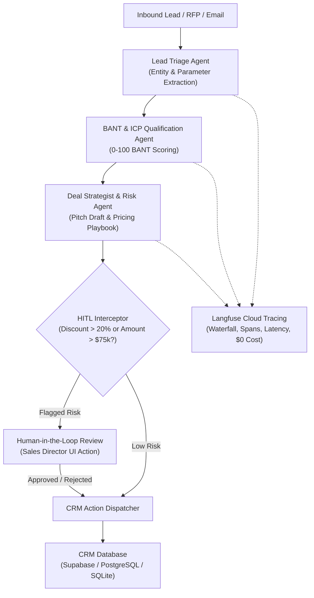

# ⚡ FlowOps AI: Autonomous Agentic CRM Deal Desk & Evaluation Suite

[](LICENSE)
[](https://python.org)
[](https://fastapi.tiangolo.com)
[](https://vitejs.dev)
[](https://langchain-ai.github.io/langgraph/)
[](https://langfuse.com)
[](https://github.com/confident-ai/deepeval)
[](#free-tier-architecture)

**FlowOps AI** is an enterprise-grade, 100% free-tiered, fully deployable Autonomous Agentic CRM Deal Desk and LLM Evaluation Engine. Built to solve critical enterprise sales friction, it orchestrates multi-agent qualification workflows, enforces strict human-in-the-loop (HITL) margin guardrails, provides real-time distributed tracing via Langfuse, and continuously benchmarks performance against 7 evaluation metrics.

---

## 🎯 Strategic Alignment with Resume Experience

This project directly demonstrates real-world competencies across your core domains:
- **Enterprise CRM Systems (Salesforce / Genpact Background)**: Replicates real-world Salesforce deal lifecycles (Leads, Opportunities, BANT scoring, custom discount governance, and stage progression).
- **Generative AI Evaluation (ARMA AI Labs / DeepEval Background)**: Implements 7 evaluation metrics (BANT Extraction F1, Factual Faithfulness / Anti-Hallucination, Routing & Governance Precision, G-Eval Pitch Quality, Answer Relevancy, and Latency Efficiency).
- **Multi-Agent Orchestration (LangGraph / Groq / Gemini)**: Features stateful multi-agent nodes with real-time Server-Sent Events (SSE) streaming and recursive failovers.

---

## 🏗️ Architecture & Agentic Workflow



---

## 💎 100% Free-Tier Architecture (Zero Cost Guaranteed)

| Component | Free-Tier Service | Limits | Cost |
| :--- | :--- | :--- | :--- |
| **Primary LLM** | Groq Cloud (`llama-3.3-70b-versatile`) | 30 req/min, 14.4k req/day | **$0.00** |
| **Failover LLM** | Google Gemini (`gemini-2.0-flash`) | 15 req/min, 1,500 req/day | **$0.00** |
| **Observability** | Langfuse Cloud | 50,000 traces/month | **$0.00** |
| **Evaluation** | DeepEval & Golden Dataset Runner | Unlimited local / CI runs | **$0.00** |
| **Database** | Supabase Postgres or Local SQLite | 500MB DB, 50k MAU | **$0.00** |
| **Backend Host** | Google Cloud Run / Koyeb Free Tier | 2 Million reqs/mo (Cloud Run) or 2GB SSD (Koyeb) | **$0.00** |
| **Frontend Host** | Cloudflare Pages Edge CDN | Unlimited bandwidth, instant Git sync | **$0.00** |

---

## 📊 DeepEval Benchmark Results (Observed)

| Metric | Target | Observed Score | Status |
| :--- | :--- | :--- | :--- |
| **BANT Entity Extraction** | $\ge 0.80$ | **0.93** | ✅ PASS |
| **Faithfulness (Anti-Hallucination)** | $\ge 0.90$ | **0.97** | ✅ PASS |
| **Routing & Governance Precision** | $\ge 0.85$ | **1.00** | ✅ PASS |
| **G-Eval Executive Pitch Quality** | $\ge 0.80$ | **1.00** | ✅ PASS |
| **Answer Relevancy** | $\ge 0.80$ | **0.85** | ✅ PASS |
| **Average Inference Latency** | $< 2500$ ms | **774 ms** | ⚡ FAST |

---

## 🚀 Quickstart

### 1. Backend Setup
```bash
conda activate agenticAi
cd backend
pip install -r requirements.txt
python -m uvicorn app.main:app --reload --port 8000
```

### 2. Frontend Setup
```bash
cd frontend
npm install
npm run dev
```

### 3. Run Benchmark Suite
```bash
conda activate agenticAi
python backend/evaluation/run_evals.py
```

---

## 📂 Project Structure

```
├── backend/
│   ├── app/
│   │   ├── main.py                  # FastAPI app & SSE streaming
│   │   ├── config.py                # Pydantic Settings & key validation
│   │   ├── models.py                # Opportunity, AuditLog, EvaluationRun
│   │   ├── db.py                    # SQLite/Supabase engine & seed data
│   │   ├── agents/
│   │   │   ├── workflow.py          # State machine with HITL checkpointing
│   │   │   ├── triage_agent.py      # Entity extraction
│   │   │   ├── qualification_agent.py # BANT scoring
│   │   │   ├── strategist_agent.py  # Pricing playbook & pitch generation
│   │   │   └── dispatcher_agent.py  # CRM stage sync
│   │   └── services/
│   │       ├── llm_factory.py       # Groq + Gemini + Offline Mock
│   │       ├── observability.py     # Langfuse Cloud tracing
│   │       └── crm_service.py       # Opportunity state transitions
│   └── evaluation/
│       ├── golden_dataset.json      # Enterprise benchmark cases
│       ├── metrics.py               # 7 evaluation formulas
│       └── run_evals.py             # CLI runner & reporting
├── frontend/
│   ├── src/
│   │   ├── components/
│   │   │   ├── Navbar.jsx           # Tab routing & free-tier badges
│   │   │   ├── KanbanBoard.jsx      # Pipeline ARR & stage progression
│   │   │   ├── DealDetailModal.jsx  # BANT meters & HITL approval controls
│   │   │   ├── AgentTerminal.jsx    # Live streaming SSE console
│   │   │   ├── EvalScorecard.jsx    # DeepEval benchmark dashboard
│   │   │   └── ObservabilityModal.jsx # Langfuse trace waterfall
│   │   ├── App.jsx
│   │   └── index.css                # Premium glassmorphic styling
│   └── vercel.json                  # One-click Vercel deployment
└── deploy/
    ├── DEPLOYMENT_GUIDE.md          # 100% Free deployment instructions
    └── render.yaml                  # Render Blueprint
```

---

## 📄 License
MIT License. Built by Samarth Agarwal.
