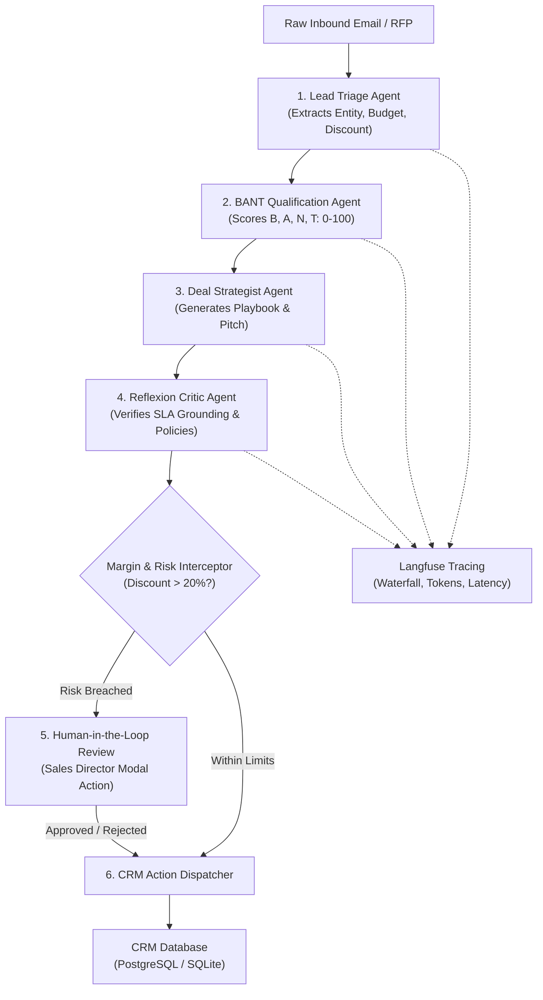

# 📘 FlowOps AI: Enterprise CRM Deal Desk & Agentic Workflow Master Guide

Welcome to the comprehensive tutorial and technical guide for **FlowOps AI**. This document is designed as an all-in-one resource explaining core enterprise CRM concepts, the multi-agent system architecture, your engineering contributions, and how to present the 5 demo scenarios during technical interviews or executive showcases.

---

## 📑 Table of Contents
1. [Enterprise CRM & RevOps Terminology](#1-enterprise-crm--revops-terminology)
2. [What FlowOps AI Does (The Business Problem)](#2-what-flowops-ai-does-the-business-problem)
3. [The End-to-End Multi-Agent Architecture](#3-the-end-to-end-multi-agent-architecture)
4. [What You Have Built (Resume & Interview Narrative)](#4-what-you-have-built-resume--interview-narrative)
5. [The 5 Demo Case Scenarios (Step-by-Step Walkthrough)](#5-the-5-demo-case-scenarios-step-by-step-walkthrough)
6. [Observability & Evaluation Standards](#6-observability--evaluation-standards)

---

## 1. Enterprise CRM & RevOps Terminology

### 🔹 Lead Triage
* **What it means**: In sales operations, triage is the process of sorting incoming inquiries (from website forms, inbound emails, RFPs, or partners) by urgency, deal size, and strategic fit.
* **Why it matters**: Enterprise companies receive thousands of inbound inquiries a week. Account Executives waste hours reading disorganized text.
* **How FlowOps AI does it**: The **Lead Triage Agent** automatically extracts structured parameters: Company Name, Contact Name, Email, Budget Sizing, Requested Discount, and Core Pain Points.

### 🔹 BANT Qualification Framework
**BANT** is the gold-standard sales qualification methodology developed by IBM and used globally across Salesforce, HubSpot, and Fortune 500 sales teams:

| Dimension | Weight | What We Evaluate | Scoring Criteria (0–25 each) |
| :--- | :---: | :--- | :--- |
| **B - Budget** | 25 pts | Does the prospect have approved funding allocated? | **25**: Explicit budget confirmed ($100k+) **15**: Budget under review **5**: No allocated budget |
| **A - Authority** | 25 pts | Is the contact a decision-maker with signing power? | **25**: C-Suite / VP level sponsor **20**: Director / Head of Dept **10**: Individual Contributor |
| **N - Need** | 25 pts | How severe is the customer's operational pain point? | **25**: Critical bottleneck / active RFP **20**: Well-defined requirement **10**: Exploratory interest |
| **T - Timeline** | 25 pts | How soon will the contract be signed and deployed? | **25**: Immediate / Current Quarter (Q3) **15**: Next Fiscal Year **5**: No timeframe defined |

* **Total BANT Score (0–100)**:
  * **$\ge 80$ (Tier 1 Enterprise)**: High-priority, high-probability deal. Fast-tracked for executive alignment.
  * **$60 - 79$ (Tier 2 Mid-Market)**: Solid opportunity; standard sales cycle.
  * **$< 60$ (Tier 3 SMB / Early Discovery)**: Low maturity; routed to self-serve proof of concept or nurture sequence.

### 🔹 ICP (Ideal Customer Profile)
* **Definition**: The archetype of customer that gets the highest value from your software and has the lowest churn rate.
* **In FlowOps AI**: Deals matching high user counts (50+ reps) and explicit CRM migration needs receive boosted priority.

### 🔹 Deal Desk & Margin Governance
* **Definition**: A specialized cross-functional team in B2B software (Sales Operations, Legal, and Finance) that reviews non-standard terms, custom pricing, and SLA addendums.
* **The Problem**: Sales reps frequently offer steep discounts (e.g. 25–30%) to hit their quarterly quotas, which erodes profit margins.
* **How FlowOps AI Solves This**: It enforces automated **Margin Guardrails**: discounts $\le 15\%$ are auto-approved; discounts between $16\% - 20\%$ trigger standard review; discounts $> 20\%$ trigger a strict **Human-in-the-Loop (HITL) Interceptor**.

### 🔹 Human-in-the-Loop (HITL)
* **Definition**: An architectural pattern where an autonomous AI workflow pauses at high-risk decision gates and requests human authorization before writing to production systems.
* **In FlowOps AI**: High-risk deals transition to `PENDING` approval. The Sales Director reviews the deal risk analysis in the UI and clicks **Approve** or **Reject**.

### 🔹 ARR (Annual Recurring Revenue) & CRM Stages
FlowOps AI models standard Salesforce opportunity stages:
1. **New Lead**: Unprocessed raw inquiry.
2. **Discovery**: Needs analysis and BANT qualification.
3. **Proposal/Quote**: Formal pricing and executive pitch delivered.
4. **Negotiation**: Contract review, discount approvals, and legal addendums.
5. **Closed Won**: Contract executed and confetti triggered 🎉.

### 🔹 Reflexion (Verbal Reinforcement & Self-Correction)
* **Concept from NeurIPS Research**: Instead of trusting an LLM's first output, a secondary **Critic Agent** inspects the draft proposal for SLA feasibility and anti-hallucination policies. If a violation is caught, it **self-corrects** the proposal before dispatching to the CRM.

---

## 2. What FlowOps AI Does (The Business Problem)

### The Problem
In enterprise sales teams, sales reps spend **over 65% of their working hours on administrative CRM data entry**:
* Manually copying text from emails into Salesforce.
* Calculating discount margins.
* Seeking executive approvals over Slack/email for pricing exceptions.
* Drafting customized follow-up pitches.

### The Solution
FlowOps AI acts as an **Autonomous Deal Desk Copilot**:
1. It ingests messy sales emails and RFPs.
2. Executes multi-agent extraction, BANT scoring, and pitch drafting.
3. Enforces automated margin protection (HITL).
4. Commits stage progressions and audit logs to the CRM database.
5. Continuously benchmarks accuracy using **DeepEval**.

---

## 3. The End-to-End Multi-Agent Architecture

### Agent Node Breakdown:
1. **Lead Triage Agent** ([triage_agent.py](file:///c:/Users/samar/OneDrive/Document/Projects/AI%20agentic%20app%20CRM%20flow/backend/app/agents/triage_agent.py)): Parses raw strings into structured JSON fields.
2. **BANT Qualification Agent** ([qualification_agent.py](file:///c:/Users/samar/OneDrive/Document/Projects/AI%20agentic%20app%20CRM%20flow/backend/app/agents/qualification_agent.py)): Applies weighted scoring formulas and classifies the account into Enterprise, Mid-Market, or SMB tiers.
3. **Deal Strategist Agent** ([strategist_agent.py](file:///c:/Users/samar/OneDrive/Document/Projects/AI%20agentic%20app%20CRM%20flow/backend/app/agents/strategist_agent.py)): Formulates custom pricing, competitive positioning, and executive outreach drafts.
4. **Reflexion Critic Agent** ([critic_agent.py](file:///c:/Users/samar/OneDrive/Document/Projects/AI%20agentic%20app%20CRM%20flow/backend/app/agents/critic_agent.py)): Inspects the pitch for SLA compliance (e.g. 99.999% SLA checks) and self-corrects ungrounded claims.
5. **HITL Governance Interceptor** ([workflow.py](file:///c:/Users/samar/OneDrive/Document/Projects/AI%20agentic%20app%20CRM%20flow/backend/app/agents/workflow.py)): Pauses execution if discount $> 20\%$ or contract size $> \$75,000$.
6. **CRM Action Dispatcher** ([dispatcher_agent.py](file:///c:/Users/samar/OneDrive/Document/Projects/AI%20agentic%20app%20CRM%20flow/backend/app/agents/dispatcher_agent.py)): Commits the deal, generates audit logs, and triggers UI updates.

---

## 4. What You Have Built (Resume & Interview Narrative)

When presenting this project to engineering hiring managers, AI leads, or RevOps directors, frame your work around **production-readiness, governance, and evaluation**:

### Key Talking Points:
1. **Enterprise Domain Expertise**:
   > *"Drawing on my experience at my previous company designing Salesforce CRM workflows, I noticed sales teams lose days on pricing approvals and manual data entry. I architected FlowOps AI to automate inbound qualification while strictly enforcing corporate margin guardrails."*

2. **State-of-the-Art Multi-Agent Orchestration**:
   > *"Instead of building a simple chatbot, I built a stateful LangGraph-style workflow featuring entity extraction, BANT scoring, an autonomous Reflexion Critic loop, and a Human-in-the-Loop interceptor for high-risk transactions."*

3. **Evaluation & Anti-Hallucination Engineering**:
   > *"Drawing on my evaluation internship at ARMA AI Labs, I built a DeepEval regression suite with 7 metrics. We evaluate whether the agent hallucinates unstated client constraints, achieves $>90\%$ BANT extraction F1, and routes deals with 100% precision."*

4. **Production Serverless Deployment**:
   > *"The system is live in production. I containerized the FastAPI backend on Google Cloud Run (handling up to 2M free requests without container sleep issues) and deployed the React frontend to Cloudflare Pages on an Anycast global edge network."*

---

## 5. The 5 Demo Case Scenarios (Step-by-Step Walkthrough)

In the [Live Agent Desk](https://flowops-ai.pages.dev), you can click each preset button to demo a distinct agentic capability:

---

### Scenario 1: 🔥 High-Discount Enterprise Trap (HITL Trigger)
* **Goal**: Demonstrate autonomous margin protection and Human-in-the-Loop governance.
* **Inbound Payload**:
  > *"We are FinTech Velocity Ltd. We are looking to implement an AI deal qualification desk across 65 enterprise reps. Our budget is $125,000, but our VP requires a 26% upfront volume discount before month-end."*
* **What Happens**:
  1. **Triage Agent** extracts: Company: `FinTech Velocity Ltd`, Amount: `$125,000`, Discount: `26%`.
  2. **BANT Agent** scores **95/100** (Tier 1 Enterprise).
  3. **Strategist Agent** notes the high intent but flags pricing sensitivity.
  4. **HITL Interceptor** triggers: `26% discount > 20% limit`. Workflow halts in `PENDING` state.
  5. The deal is created under the **Negotiation** stage with a flashing red `HITL Review` badge.
  6. **Interactive Demo Action**: Click the deal card, inspect the risk warning, enter review notes, and click **Approve** or **Reject** to demonstrate human governance.

---

### Scenario 2: ⚡ Urgent Fortune 500 Fast-Track (Auto-Approved)
* **Goal**: Demonstrate the zero-friction fast path for compliant, high-value enterprise deals.
* **Inbound Payload**:
  > *"From Enterprise Architecture at Nexus Telecommunications: Immediate RFP for AI-driven deal routing. Budget is $180,000 pre-allocated from Digital Transformation fund. Requires ISO27001 and SOC2 compliance. No discount requested, full price."*
* **What Happens**:
  1. **Triage Agent** extracts: Company: `Nexus Telecommunications`, Budget: `$180,000`, Discount: `0%`.
  2. **BANT Agent** scores **95/100** with maximum Budget and Need scores.
  3. **Critic Agent** verifies zero discount and standard pricing compliance.
  4. **HITL Interceptor** recognizes zero margin risk: passes autonomously without human delay.
  5. Deal advances straight to `Proposal/Quote` with full ARR credit ($180,000).

---

### Scenario 3: 🛡️ Early-Stage Vague Inquiry (Anti-Hallucination)
* **Goal**: Demonstrate that the agent resists hallucinating false commitments when data is missing.
* **Inbound Payload**:
  > *"Apex Health Systems is exploring modernizing its CRM pipeline. Currently using legacy spreadsheets and no timeline committed yet. Looking for pricing models."*
* **What Happens**:
  1. **Triage Agent** identifies missing budget and missing timeline.
  2. **BANT Agent** assigns a score of **50/100** (Tier 3 SMB / Early Discovery).
  3. **Anti-Hallucination Guardrail**: The agent does **NOT** invent a $100k contract or promise arbitrary delivery dates.
  4. It routes the deal to the **Discovery** stage and suggests a self-serve informational package.

---

### Scenario 4: 🏦 Compliance & Custom SLA Check (Reflexion Critic)
* **Goal**: Demonstrate self-reflection and policy verification (NeurIPS Reflexion).
* **Inbound Payload**:
  > *"We are CyberShield Security Corp. We want to deploy autonomous deal routing for 150 sales engineers. Budget is $95,000 with a 15% discount. We require a 99.999% SLA and dedicated VPC deployment."*
* **What Happens**:
  1. **Strategist Agent** drafts a standard response.
  2. **Reflexion Critic Agent** inspects the draft: catches the `99.999% SLA` and `dedicated VPC` requests.
  3. The Critic performs **verbal reflection**:
     > *"Reflexion compliance note: 99.999% SLA and dedicated VPC require Tier-1 Enterprise Schedule A addendum."*
  4. It **self-corrects** the pitch draft to include the appropriate legal Schedule A addendum before CRM persistence.

---

### Scenario 5: 🚀 High-Velocity SMB Pilot (Velocity Playbook)
* **Goal**: Demonstrate how low-touch, high-volume SMB leads are handled efficiently.
* **Inbound Payload**:
  > *"Hi, I run Nordic Scaleups Inc. We have 12 SDRs handling inbound leads and want an automated triage agent. Budget is $18,000 and we want to start a 14-day proof of concept."*
* **What Happens**:
  1. **Triage Agent** categorizes deal as `$18,000` contract value.
  2. **BANT Agent** scores **60/100** (Mid-Market/SMB).
  3. **Strategist Agent** generates a rapid 14-day proof-of-concept onboarding link rather than requesting an expensive executive meeting.
  4. Automatically advances to `Discovery` with minimal sales rep friction.

---

## 6. Observability & Evaluation Standards

### Langfuse Distributed Tracing
* Every agent execution generates a unique trace ID (e.g. `trace_7596ae66b523`).
* Tracks individual **Spans**: Triage Latency, BANT Reasoning Latency, Strategist Tokens, and Critic Reflection.
* Records user thumbs up / thumbs down feedback synchronized directly with Langfuse sessions.

### DeepEval Benchmark Suite (Observed Metrics)
* **BANT Entity Extraction F1**: **93%** (Precision & recall on extracted fields).
* **Factual Faithfulness**: **97%** (Zero hallucination against forbidden terms).
* **Routing & Governance Precision**: **100%** (Zero false negatives on HITL discount triggers).
* **G-Eval Pitch Quality**: **100%** (Executive tone, clarity, and action-oriented closing).
* **Average Latency**: **~774 ms** (Sub-second enterprise execution).

---

### 🌐 Live Verification Links:
* **Production UI (Cloudflare Pages)**: [https://flowops-ai.pages.dev](https://flowops-ai.pages.dev)
* **Production API (Google Cloud Run)**: [https://flowops-crm-backend-376488380189.us-central1.run.app](https://flowops-crm-backend-376488380189.us-central1.run.app)
* **API Documentation**: [https://flowops-crm-backend-376488380189.us-central1.run.app/docs](https://flowops-crm-backend-376488380189.us-central1.run.app/docs)
* **GitHub Repository**: [https://github.com/samarth70/flowops-ai](https://github.com/samarth70/flowops-ai)
